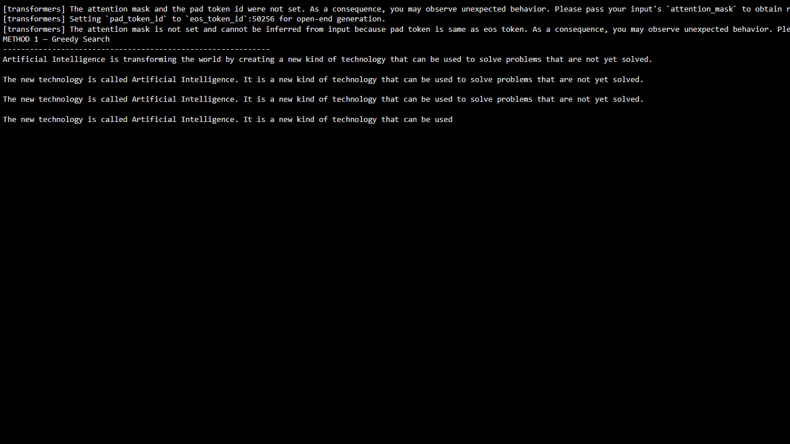
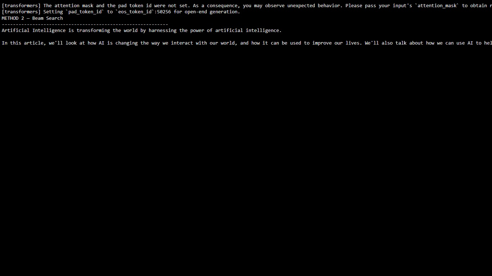
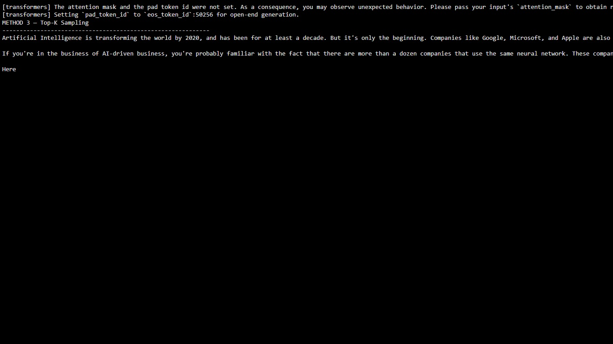
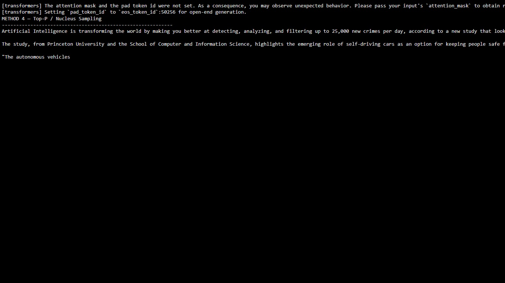
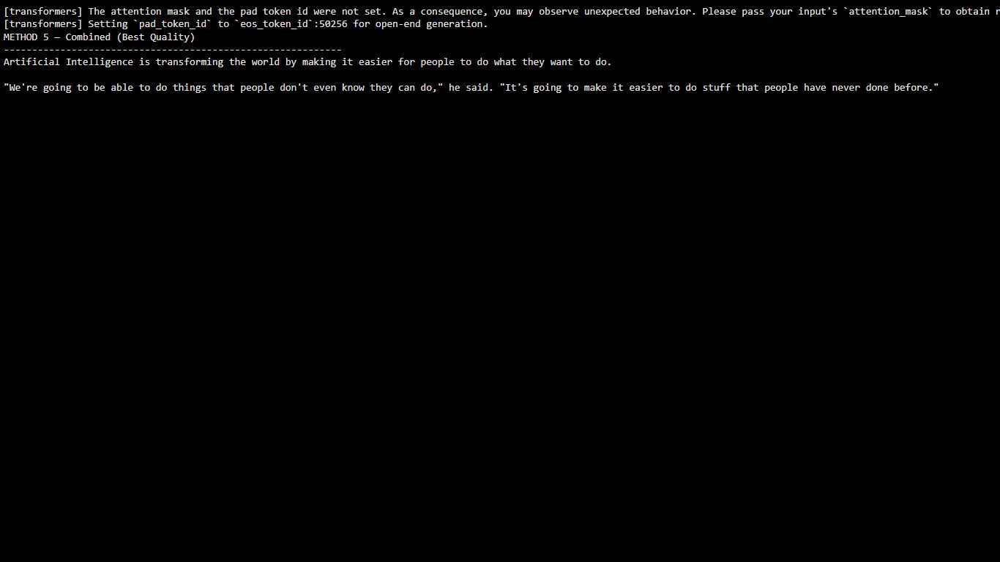
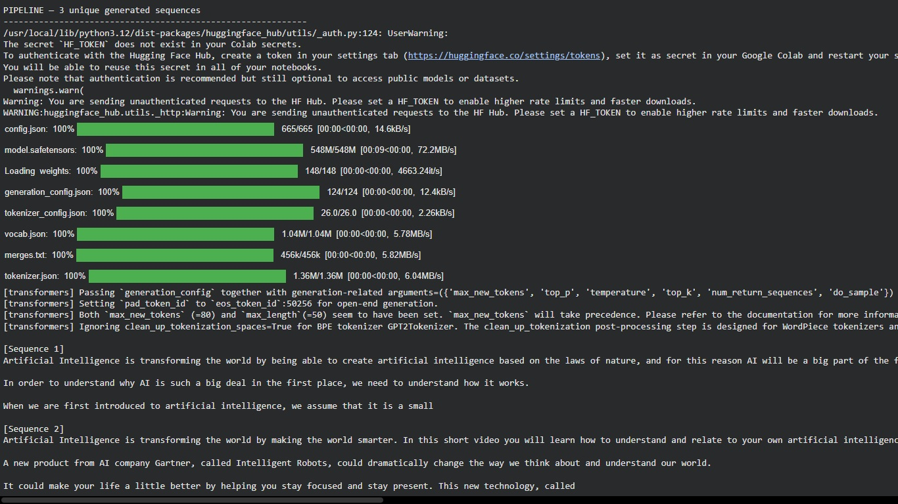
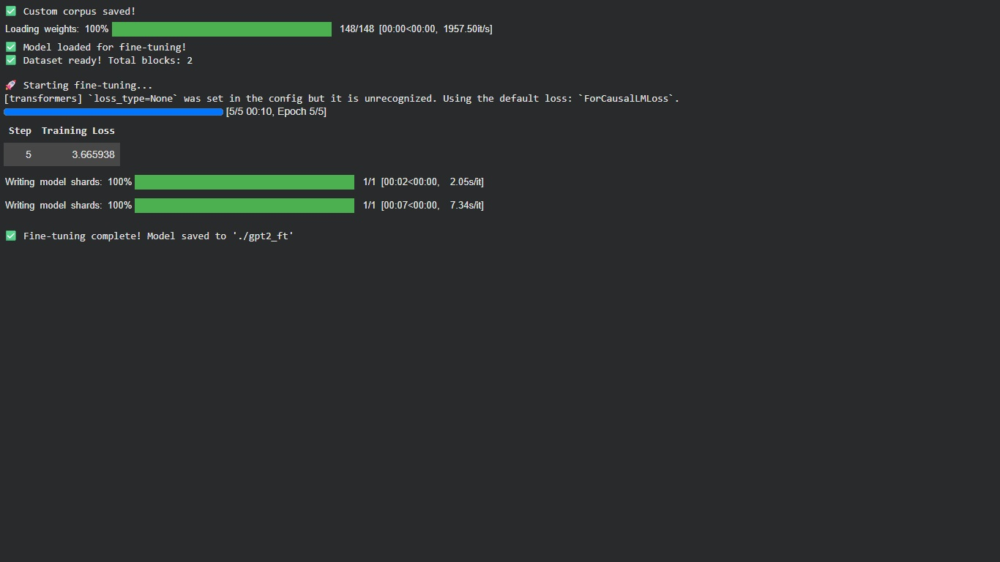
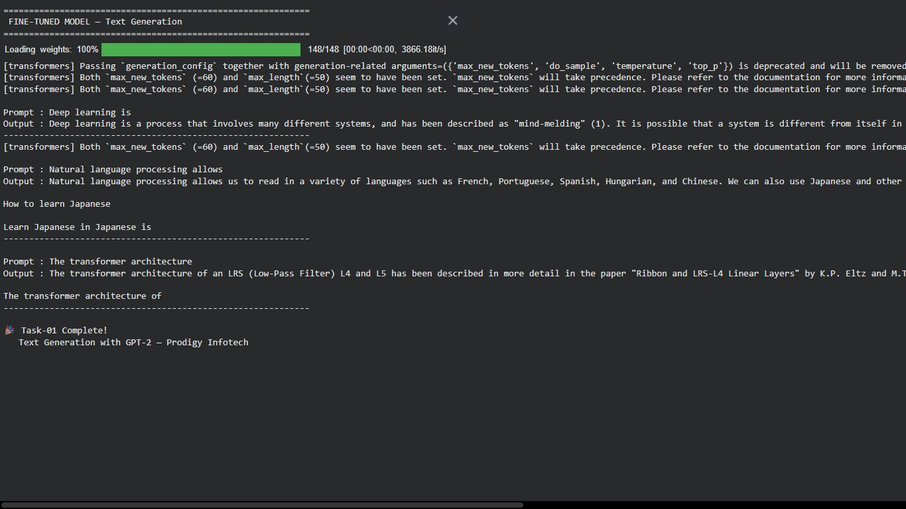

# 🤖 PRODIGY_SK_01 — Text Generation with GPT-2
### Prodigy Infotech — Generative AI Internship | Task-01

---

## 📌 Objective
Train and fine-tune GPT-2 to generate coherent and 
contextually relevant text based on a given prompt.

---

## ✅ What I Did
- Loaded GPT-2 using HuggingFace Transformers
- Explored 5 decoding strategies:
  - Greedy Search
  - Beam Search
  - Top-K Sampling
  - Top-P / Nucleus Sampling
  - Combined Strategy
- Generated text using Pipeline API (3 sequences)
- Fine-tuned GPT-2 on a custom AI dataset

---

## 📸 Output Screenshots

### Method 1 — Greedy Search

### Method 2 — Beam Search

### Method 3 — Top-K Sampling

### Method 4 — Top-P Sampling

### Method 5 — Combined Strategy

### Pipeline — 3 Sequences

### Fine-Tuning Training

### Fine-Tuned Model Output

### Complete Output

---

## 📊 Results

| Method | Output Style |
|---|---|
| Greedy Search | Repetitive — got stuck in loops |
| Beam Search | Clean coherent article style |
| Top-K Sampling | Creative — mentioned real companies |
| Top-P Sampling | Natural news article style |
| Combined | Conversational style |
| Fine-Tuned Model | Domain specific AI text |

---

## 🛠 Tech Stack
- Python
- PyTorch
- HuggingFace Transformers
- Google Colab (T4 GPU)

---

## 📎 References
- [HuggingFace Blog](https://huggingface.co/blog/how-to-generate)
- [Reference Notebook](https://colab.research.google.com/drive/15qBZx5y9rdaQSyWpsreMDnTiZ5IlN0zD)

---

## 👤 Author
Karthika — Generative AI Intern @ Prodigy Infotech
